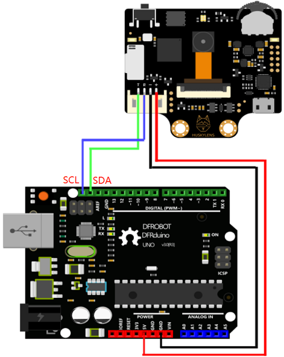

# FaceID
## _Facial recognition | HTTP-server | Rust => Blazingly fast and secure data-storage_

[![some]][link]

[some]: https://img.shields.io/badge/current_stable_release-1.0-blue
[link]: https://github.com/mejerfromperu/faceID

*** 
## Pre-requisites
To run project, first run on an x86-based Windows PC, as Rust-code expects the platform to be this platform. 

Next - connect the HUSKYLENS to an Arudino Uno (this project uses an R3-unit) using I2C-protocol. Connection-schema and settings to use on the HUSKYLENS are found [here](https://wiki.dfrobot.com/HUSKYLENS_V1.0_SKU_SEN0305_SEN0336#target_30)

Make sure to note which COM-port the Arduino is connected within the Arduino IDE, as this is important for which port the Rust-server attempts to read from. 

When the Arduino is connected to the HUSKYLENS, attempt to flash the Arduino with the code within `SimpleHttpServer/src/arduino_code/arduino_code.ino`
If it goes well, close the IDE as the port will be blocked and cannot be accessed from Rust. If you note a different COM-port than 4, edit this within the main-function in `SimpleHttpServer/src/main.rs` 

***
If you are tottaly sure your Arduino is connected to COM4, you can just run SimpleHttpServer.exe from releases

